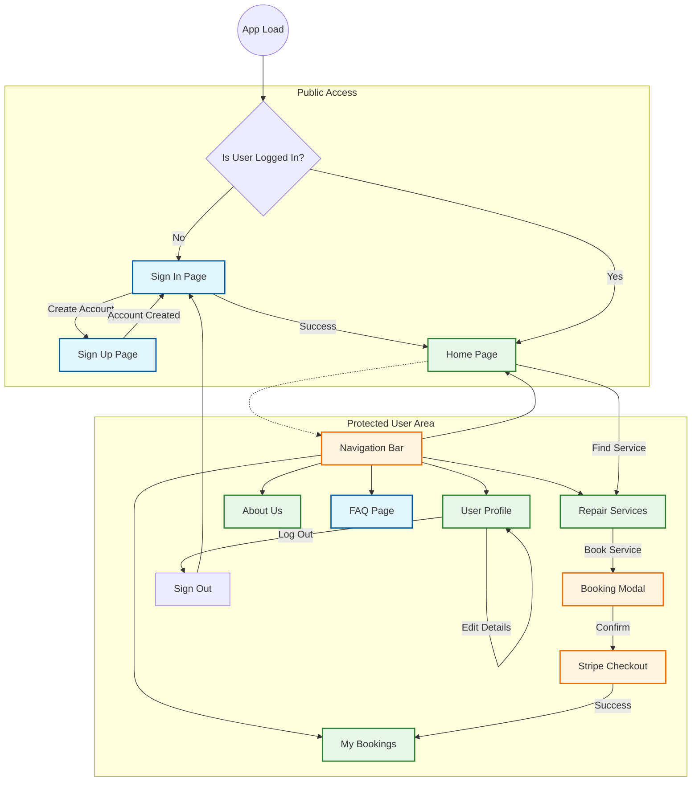

# 🗺️ Application Page Architecture

This document outlines the high-level page flow and interaction within the **HandyHouse Services** frontend.

## 🧭 Navigation Flow

The application uses `react-router-dom` for client-side routing. Access to most pages is protected and requires user authentication.

## 📄 Key Page Descriptions

| Page Route | Component | Access | Description |
| :--- | :--- | :--- | :--- |
| `/` | `HomePage` | 🔒 Protected | The main dashboard displaying recommendations, popular services, and quick access links. |
| `/signin` | `SimpleCard` | 🌍 Public | User login interface with Email/Password and Google OAuth support. |
| `/signup` | `SignupCard` | 🌍 Public | New user registration form. |
| `/RepairServices` | `RepairServices` | 🔒 Protected | Lists available home services, trending options, and allows users to initiate bookings. |
| `/myBookings` | `UserBookings` | 🔒 Protected | Displays current and past service bookings with status updates. |
| `/userProfile` | `UserProfile` | 🔒 Protected | User account details, settings, and address management. |
| `/aboutUs` | `AboutUs` | 🔒 Protected | Information about the HandyHouse Services platform and team. |
| `/Faq` | `Faq` | 🌍 Public* | Frequently asked questions and support information. |

> *Note: While FAQ is generally public information, the current routing configuration may require login depending on specific implementation details.*
