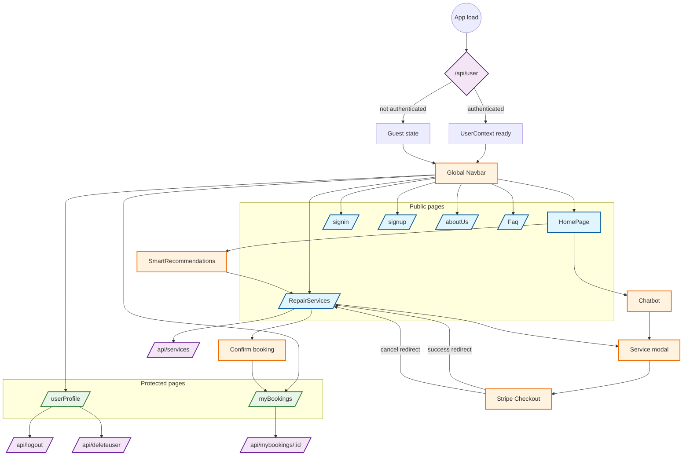

# 🗺️ Application Page Architecture

This document reflects the current page flow and interaction model in the **HandyHouse Services** frontend.

## 🧭 Current Flow

The app uses `react-router-dom` for client-side routing and wraps the UI in `ChakraProvider` plus a global `BrowserRouter`. On startup, `App` checks the signed-in user by calling `/api/user` with credentials. A global navbar is always rendered, while only `userProfile` and `myBookings` are guarded by `ProtectedRoute`.

```mermaid
graph TD
    classDef public fill:#e1f5fe,stroke:#01579b,stroke-width:2px;
    classDef protected fill:#e8f5e9,stroke:#2e7d32,stroke-width:2px;
    classDef component fill:#fff3e0,stroke:#ef6c00,stroke-width:2px;
    classDef api fill:#f3e5f5,stroke:#6a1b9a,stroke-width:2px;

    Start((App load)) --> UserCheck{/api/user}
    UserCheck -->|authenticated| Session[UserContext ready]
    UserCheck -->|not authenticated| Guest[Guest state]

    Session --> Navbar[Global Navbar]
    Guest --> Navbar

    subgraph PublicPages [Public pages]
        Home[HomePage]
        SignIn[/signin/]
        SignUp[/signup/]
        Repair[/RepairServices/]
        About[/aboutUs/]
        FAQ[/Faq/]
    end

    subgraph ProtectedPages [Protected pages]
        Profile[/userProfile/]
        Bookings[/myBookings/]
    end

    Navbar --> Home
    Navbar --> Repair
    Navbar --> About
    Navbar --> FAQ
    Navbar --> SignIn
    Navbar --> SignUp
    Navbar --> Profile
    Navbar --> Bookings

    Home --> Recommendations[SmartRecommendations]
    Home --> Assistant[Chatbot]
    Recommendations --> Repair
    Assistant --> ServiceModal[Service modal]
    Repair --> ServicesAPI[/api/services/]
    Repair --> ServiceModal
    ServiceModal --> Checkout[Stripe Checkout]
    Checkout -->|success redirect| Repair
    Checkout -->|cancel redirect| Repair
    Repair --> Confirm[Confirm booking]
    Confirm --> Bookings

    Profile --> Logout[/api/logout/]
    Profile --> Delete[/api/deleteuser/]
    Bookings --> Cancel[/api/mybookings/:id/]

    class Home,SignIn,SignUp,Repair,About,FAQ public;
    class Profile,Bookings protected;
    class Navbar,Recommendations,Assistant,ServiceModal,Checkout,Confirm component;
    class UserCheck,ServicesAPI,Logout,Delete,Cancel api;
```

## 📄 Key Page Descriptions

| Page Route | Component | Access | Description |
| :--- | :--- | :--- | :--- |
| `/` | `HomePage` | 🌍 Public | Landing page with the hero section, floating AI assistant, and location-based recommendations. |
| `/signin` | `SimpleCard` | 🌍 Public | Email/password sign-in entry point that establishes the auth cookie. |
| `/signup` | `SignupCard` | 🌍 Public | New user registration form. |
| `/RepairServices` | `RepairServices` | 🌍 Public* | Service catalog page that fetches available services, handles booking starts, and processes Stripe return states. |
| `/aboutUs` | `AboutUs` | 🌍 Public | Static company and platform information. |
| `/Faq` | `Faq` | 🌍 Public | Support and common questions page. |
| `/userProfile` | `UserProfile` | 🔒 Protected | Signed-in user profile, edit, logout, and account deletion actions. |
| `/myBookings` | `UserBookings` | 🔒 Protected | Authenticated booking history, cancellation, and provider details. |

> *Booking itself is still gated by authentication inside the page flow. If a signed-out user tries to book, they are redirected to `/signin`.

## 🔄 User Journey

1. The user lands on `/` and can explore the hero section, chatbot, and recommended services.
2. The user can browse `/RepairServices` directly or arrive there from recommendations or chatbot suggestions.
3. Selecting a service opens `serviceproviderModal`, collects booking details, and launches Stripe Checkout through `CheckOutButton`.
4. Stripe returns the user to `/RepairServices` with a payment result query string.
5. The page confirms the booking through `/api/payments/confirm-booking`, then the booking appears in `/myBookings`.
6. The user can update profile details on `/userProfile`, review bookings on `/myBookings`, or log out.

## 🔌 Backend Endpoints Used By The UI

| Endpoint | Purpose |
| :--- | :--- |
| `/api/user` | Loads the signed-in user into `UserContext`. |
| `/api/signin` | Authenticates a user and sets the session cookie. |
| `/api/signup` | Creates a new account. |
| `/api/logout` | Clears the auth cookie. |
| `/api/services` | Returns the service catalog shown on Repair Services. |
| `/api/chatbot` | Generates AI-based service recommendations. |
| `/api/location-analytics` | Powers neighborhood-aware service recommendations. |
| `/api/payments/createCheckoutSession` | Starts Stripe checkout for a booking. |
| `/api/payments/confirm-booking` | Finalizes a successful booking after payment. |
| `/api/mybookings` | Returns the current user’s booking history. |
| `/api/mybookings/:id` | Cancels a booking. |
| `/api/deleteuser` | Deletes the active account. |
