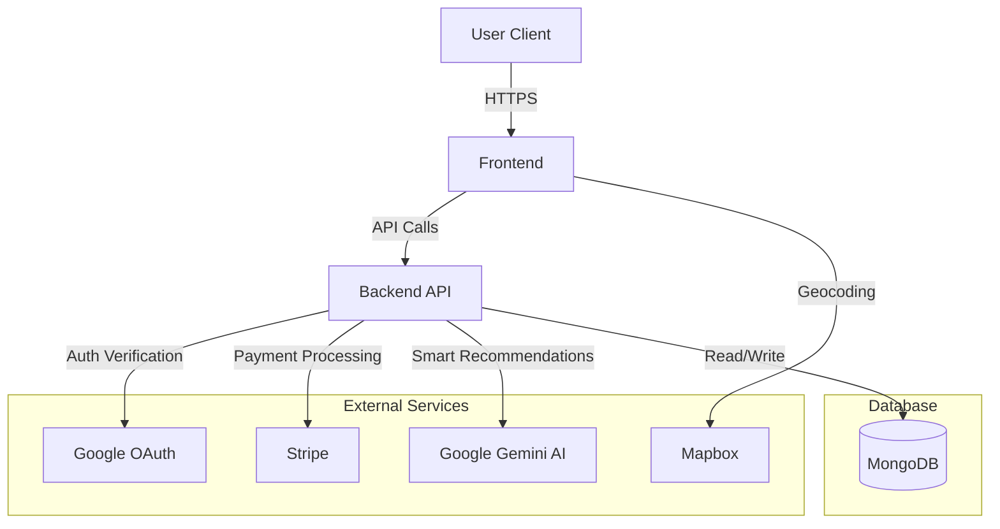

# 🏠 HandyHouse Services

HandyHouse Services is a modern, full-stack web application designed to connect users with reliable home service providers. Whether you need plumbing, electrical work, cleaning, or repairs, HandyHouse makes it easy to find, book, and pay for services securely.

The platform leverages **AI-powered recommendations**, **location-based intelligence**, and **real-time booking analytics** to provide a seamless user experience.

---

## 🏗️ Project Structure

The project is organized as a monorepo with separate directories for the frontend and backend:

```
HandyHouseServices/
├── handyHouseServicesBackend/    # Node.js/Express API Server
│   ├── config/                   # Database configuration
│   ├── controllers/              # Request handlers
│   ├── models/                   # Mongoose schemas (Users, Services, Bookings)
│   ├── routes/                   # API routes
│   ├── utils/                    # Helper functions (Gemini AI, Email)
│   ├── index.js                  # Entry point
│   └── vercel.json               # Backend deployment config
│
└── handyHouseServicesFrontend/   # React/Vite Client Application
    ├── src/
    │   ├── assets/               # Images and static assets
    │   ├── components/           # Reusable UI components
    │   ├── pages/                # Application pages
    │   ├── reducer/              # State management
    │   └── App.jsx               # Main component
    ├── public/                   # Public assets
    └── vite.config.js            # Vite configuration
```

---

## 🚀 Unique Functionalities

1.  **🤖 Smart AI Recommendations**:
    *   Utilizes **Google Gemini 2.0 Flash** to analyze user queries and recommend specific home services.
    *   **Booking-Based Suggestions**: Recommends services based on real booking data from neighbors and trends in the user's city/area.

2.  **💬 Intelligent Chatbot**:
    *   An integrated AI chatbot assists users in finding services and answering queries in real-time.

3.  **📍 Location Intelligence**:
    *   Integrated with **Mapbox** for precise address selection and location-based service provider matching.
    *   **Location Analytics** to provide insights on service demand in different regions.

4.  **💳 Secure Payments**:
    *   Seamless payment processing integration using **Stripe**.

5.  **🔐 Robust Authentication**:
    *   Supports traditional Email/Password login and **Google OAuth** for quick access.
    *   Secured with **JWT (JSON Web Tokens)**.

6.  **📊 Service Provider Management**:
    *   Dedicated portal for service providers to manage their profiles and bookings.

---

## 🛠️ Tech Stack

### **Frontend**
*   **Framework**: [React](https://react.dev/) (powered by [Vite](https://vitejs.dev/))
*   **Styling**: [Tailwind CSS](https://tailwindcss.com/), [Chakra UI](https://chakra-ui.com/)
*   **Maps**: [Mapbox GL JS](https://www.mapbox.com/)
*   **State Management**: React Context / Reducer
*   **Animations**: [Framer Motion](https://www.framer.com/motion/)
*   **Icons**: [Lucide React](https://lucide.dev/), [React Icons](https://react-icons.github.io/react-icons/)

### **Backend**
*   **Runtime**: [Node.js](https://nodejs.org/)
*   **Framework**: [Express.js](https://expressjs.com/)
*   **Database**: [MongoDB](https://www.mongodb.com/) (Mongoose ODM)
*   **AI/LLM**: [Google Gemini API](https://ai.google.dev/) (`@google/genai`)
*   **Authentication**: JSON Web Tokens (JWT), Google Auth Library
*   **Payments**: [Stripe API](https://stripe.com/)
*   **Email**: Nodemailer

---

## 🏛️ Architecture Diagram



---

## ⚡ How to Install and Run

### Prerequisites
*   Node.js (v16 or higher)
*   MongoDB Atlas Account (or local MongoDB)
*   APIs Keys for: Google Gemini, Mapbox, Stripe, Google OAuth.

### 1. Clone the Repository
```bash
git clone https://github.com/yourusername/HandyHouseServices.git
cd HandyHouseServices
```

### 2. Backend Setup
Navigate to the backend folder and install dependencies:
```bash
cd handyHouseServicesBackend
npm install
```

Create a `.env` file in `handyHouseServicesBackend/` and configure your environment variables:
```env
PORT=5000
MONGO_URI=your_mongodb_connection_string
JWT_SECRET=your_jwt_secret
GEMINI_API_KEY=your_gemini_api_key
STRIPE_SECRET_KEY=your_stripe_secret_key
# Add other required keys (Google OAuth, Email, etc.)
```

Start the server:
```bash
npm start
# OR for development
npm run dev
```

### 3. Frontend Setup
Open a new terminal, navigate to the frontend folder, and install dependencies:
```bash
cd ../handyHouseServicesFrontend
npm install
```

Create a `.env` file in `handyHouseServicesFrontend/` (if required by your config) or configure `src/` constants.

Start the development server:
```bash
npm run dev
```

The application should now be running at `http://localhost:5173` (Frontend) and `http://localhost:5000` (Backend).

