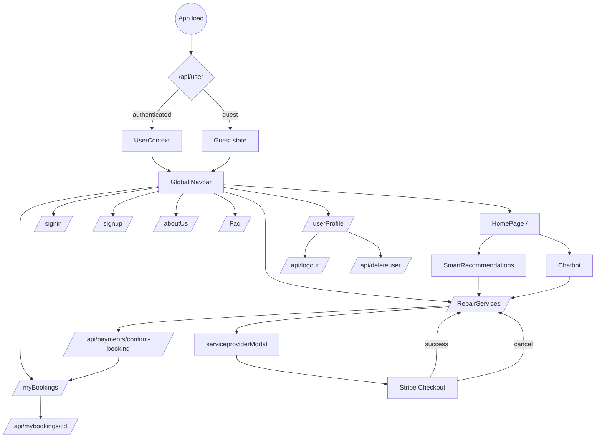

# HandyHouse Services

HandyHouse Services is a full-stack home-service booking app. The current user flow is:
home page discovery, service browsing, modal-based booking, Stripe checkout, and booking history management for signed-in users.

The frontend now exposes a public landing experience with an AI assistant and location-aware recommendations, while profile and booking history remain protected behind authentication.

## Project Structure

```text
HandyHouseServices/
├── handyHouseServicesBackend/    Node.js/Express API server
│   ├── config/                   Database configuration
│   ├── controllers/              Request handlers
│   ├── models/                   Mongoose schemas
│   ├── routes/                   API endpoints
│   ├── utils/                    Gemini and email helpers
│   └── index.js                  Server entry point
└── handyHouseServicesFrontend/   React/Vite client
    ├── src/
    │   ├── Auth/                 Sign in and sign up screens
    │   ├── components/           Shared UI and booking components
    │   ├── pages/                Home, services, profile, bookings, FAQ
    │   └── App.jsx               Router and protected-route setup
    └── vite.config.js            Vite configuration
```

## Current App Flow


```mermaid
graph TD
    Start((App load)) --> AuthCheck{/api/user}
    AuthCheck -->|authenticated| UserCtx[UserContext]
    AuthCheck -->|guest| GuestState[Guest state]

    UserCtx --> Nav[Global Navbar]
    GuestState --> Nav

    Nav --> Home[HomePage /]
    Nav --> SignIn[/signin/]
    Nav --> SignUp[/signup/]
    Nav --> Repair[/RepairServices/]
    Nav --> About[/aboutUs/]
    Nav --> FAQ[/Faq/]
    Nav --> Profile[/userProfile/]
    Nav --> Bookings[/myBookings/]

    Home --> Recs[SmartRecommendations]
    Home --> Bot[Chatbot]
    Recs --> Repair
    Bot --> Repair

    Repair --> Modal[serviceproviderModal]
    Modal --> Stripe[Stripe Checkout]
    Stripe -->|success| Repair
    Stripe -->|cancel| Repair
    Repair --> Confirm[/api/payments/confirm-booking/]
    Confirm --> Bookings

    Profile --> Logout[/api/logout/]
    Profile --> Delete[/api/deleteuser/]
    Bookings --> Cancel[/api/mybookings/:id/]
```

## Pages And Access

| Route | Component | Access | Notes |
| :--- | :--- | :--- | :--- |
| `/` | `HomePage` | Public | Hero section, floating AI assistant, and nearby booking recommendations. |
| `/signin` | `SimpleCard` | Public | Email/password sign-in that sets the session cookie. |
| `/signup` | `SignupCard` | Public | New account registration. |
| `/RepairServices` | `RepairServices` | Public* | Service catalog, booking start point, and Stripe return handling. |
| `/aboutUs` | `AboutUs` | Public | About page. |
| `/Faq` | `Faq` | Public | FAQ/support page. |
| `/userProfile` | `UserProfile` | Protected | View/edit profile, logout, delete account. |
| `/myBookings` | `UserBookings` | Protected | Booking history and cancellation. |

*Booking itself still requires authentication. If a guest tries to book, the UI redirects them to `/signin`.

## Key Features In The Current Flow

1. `HomePage` shows the main landing experience and embeds both `SmartRecommendations` and the chatbot.
2. `RepairServices` fetches the service catalog from `/api/services` and opens `serviceproviderModal` when the user chooses to book.
3. `CheckOutButton` starts Stripe checkout through `/api/payments/createCheckoutSession`.
4. Successful Stripe return handling happens back on `/RepairServices`, where `/api/payments/confirm-booking` finalizes the booking.
5. `UserBookings` reads from `/api/mybookings` and supports cancellation through `/api/mybookings/:id`.
6. `UserProfile` uses `/api/user`, `/api/logout`, and `/api/deleteuser` for account management.

## Backend Endpoints Used By The Frontend

| Endpoint | Purpose |
| :--- | :--- |
| `/api/user` | Loads the current signed-in user. |
| `/api/signin` | Authenticates the user and sets the auth cookie. |
| `/api/signup` | Creates a new user. |
| `/api/logout` | Clears the auth cookie. |
| `/api/services` | Returns the service list. |
| `/api/chatbot` | Returns Gemini-based service suggestions. |
| `/api/location-analytics` | Powers location-based recommendation data. |
| `/api/payments/createCheckoutSession` | Starts Stripe checkout. |
| `/api/payments/confirm-booking` | Confirms a paid booking after redirect. |
| `/api/mybookings` | Returns the current user’s bookings. |
| `/api/mybookings/:id` | Cancels a booking. |
| `/api/deleteuser` | Deletes the current account. |

## Tech Stack

### Frontend

- React with Vite
- Chakra UI and Tailwind CSS
- Framer Motion
- Lucide React and React Icons
- Mapbox for location-aware features

### Backend

- Node.js and Express
- MongoDB with Mongoose
- Google Gemini via `@google/genai`
- JWT cookie-based authentication
- Stripe payments
- Nodemailer for booking emails

## Run Locally

### Prerequisites

- Node.js 16+
- MongoDB connection string
- Environment keys for Gemini, Stripe, Mapbox, and the app client/backend URLs

### Backend

```bash
cd handyHouseServicesBackend
npm install
npm start
```

### Frontend

```bash
cd handyHouseServicesFrontend
npm install
npm run dev
```

The frontend runs on `http://localhost:5173` and the backend runs on the configured API port, typically `http://localhost:5000`.

